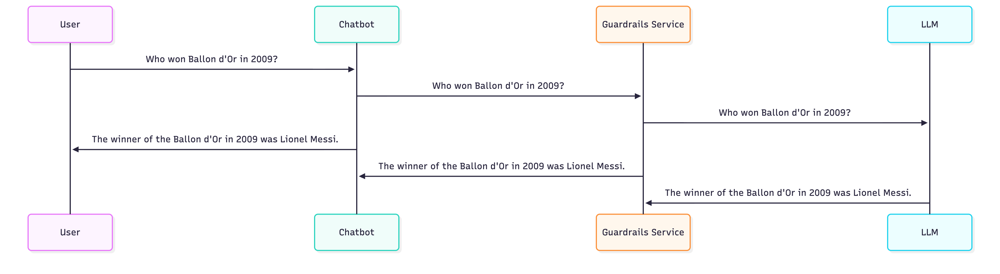

# llmops

A simple llmops

- Components
   - Chat front end
   - Guardrails middleware  
   - Ollama LLM backend
   - Custom Arize Logging

- Demo
   
   [](https://github.com/user-attachments/assets/facac68e-a6a5-44d5-8e19-6cdedc3b487a)


   <!-- <video width="60%" controls>
      <source src="https://github.com/user-attachments/assets/facac68e-a6a5-44d5-8e19-6cdedc3b487a">
   </video>
    -->

- Flow

   - Guardrails Disabled

      

   - Guardrails Enabled

      

  


## Prerequisites

- Install Docker from [here](https://docs.docker.com/get-docker/)
- Get Guardrails token:
  - Visit [Guardrails AI Hub](https://hub.guardrailsai.com/)
  - Sign up or log in to your account
  - Navigate to your account settings or API keys section
  - Copy your token and save it somewhere.

### Running the Code

1. Run below commands:
   ```bash
   git clone https://github.com/abhishek9sharma/llmops.git
   cd llmops
   ```

2. **Create a `.env` file** in the root directory. Your structure should look like:
   ```
   llmops/
   ├── .env           ← Create this file here
   ├── docker-compose.yml
   ├── Makefile
   ├── grserver/
   ├── ollama-backend/
   ├── streamlit-chat/
   └── README.md
   ```
   ```bash
   touch .env
   ```


3. **Add your Guardrails token** to the `.env` file:
   ```bash .env
   GR_TOKEN=your_guardrails_token_here
   ```

4. **Optional**: Add other environment variables:
   ```bash .env
   GR_TOKEN=your_guardrails_token_here
   OPENAI_API_KEY=your_openai_api_key
   ANOTHER_VARIABLE=value
   ```

5. **Run the application**:
   ```bash
   make up_with_build
   ```
   This will take a while do build.

6. Navigate to [http://localhost:8501/](http://localhost:8501/)